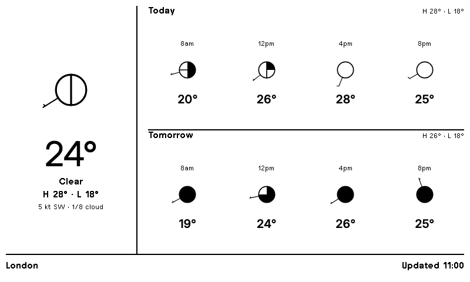

# Weather Circles

A TRMNL plugin that shows a 2-day forecast using UK Met Office–style weather
station circles (cloud-cover oktas + wind barbs) instead of icons.



## Forecast slots

Each day shows seven station circles, every 2 hours from 8am to 8pm. Rather
than sampling only that exact hour, each slot scans every hour up to the
next slot and renders whichever hour is most significant — ranked by
precipitation severity (thunder > heavy rain > snow shower > snow > sleet >
rain > drizzle > fog > mist), falling back to the cloudiest hour if none of
them have precipitation. That way a shower that falls between two slots
still shows up in the icon instead of disappearing between samples.

Seven slots already wrap to two rows in the `full` layout's fixed
4-column grid, so `--days` defaults to 1 — a second day at this density
overflows the 480px frame. Pass `--days 2` if you've widened the grid to
fit it.

## Deploying the CGI (dynamic location)

`weather.cgi` builds the polling JSON per request, with the location taken
from the query string (`?q=Manchester`, or `?lat=…&lon=…&name=…` to override).
The TRMNL plugin's **Location** custom field is interpolated into the polling
URL (`weather.cgi?q={{ location | url_encode }}`).

1. Put the checkout on the server and enable CGI for its directory in Apache:

   ```apache
   <Directory /var/www/html/weather-circles>
       Options +ExecCGI
       AddHandler cgi-script .cgi
       # only needed if weather.cgi is NOT alongside trmnl_report.py:
       SetEnv WEATHER_CIRCLES_DIR /path/to/checkout
       Require all granted
   </Directory>
   ```

   ```bash
   sudo a2enmod cgi && sudo systemctl reload apache2
   chmod +x weather.cgi
   ```

2. `REPO_DIR` defaults to the script's own directory; set `WEATHER_CIRCLES_DIR`
   only if `weather.cgi` lives apart from `trmnl_report.py`.

3. Test:

   ```bash
   curl 'https://your-host/weather-circles/weather.cgi?q=Paris'   # → "Paris, FR"
   curl 'https://your-host/weather-circles/weather.cgi'           # → London
   ```

Only stdlib is required (Python 3, headless Chrome only for local PNG previews).
