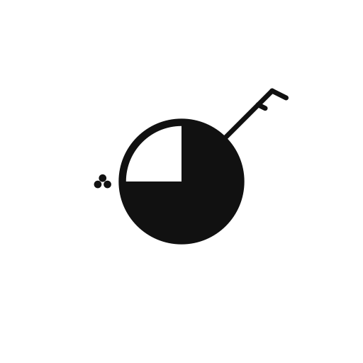
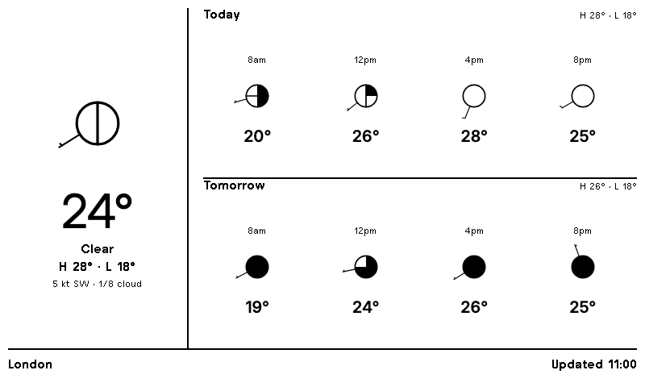

# Weather Circles

A TRMNL plugin that shows a 2-day forecast using UK Met Office–style weather
station circles (cloud-cover oktas + wind barbs) instead of icons.



## Forecast slots

Each day shows a fixed number of station circles, depending on the
**Forecast Range** setting:

- **1 day** (default) — 8 slots, every 2 hours from 8am to 10pm, wrapping
  to two full rows in the `full` layout's 4-column grid.
- **2 days** — 4 slots/day, every 4 hours from 8am to 8pm, one row per day.

Rather than sampling only the exact slot hour, each slot scans every hour
up to the next slot and renders whichever hour is most significant —
ranked by precipitation severity (thunder > heavy rain > snow shower >
snow > sleet > rain > drizzle > fog > mist), falling back to the cloudiest
hour if none of them have precipitation. That way a shower that falls
between two slots still shows up in the icon instead of disappearing
between samples.

The slot *count* is fixed per range (8 for 1 day, 4 for 2 days) so the
grid always wraps cleanly, but *which* hours fill those slots can be
overridden with the **Forecast Hours** custom field (comma-separated 24h
hours, e.g. `6,9,12,15,18,21,0,3`). The count must match the chosen range
or the override is ignored in favour of the default hours for that range.
On the CLI this is `--days {1,2}` and `--hours`.

### Rolling slots

The **Rolling Slots** custom field (`--rolling` on the CLI) replaces fixed
clock times with a window that starts at the current hour and steps
forward by 2h on every refresh ("now..+2h", "+2h..+4h", ...), so the
forecast always shows what's coming up next rather than the same eight
clock times regardless of when you look. It overrides Forecast Hours.

- **1 day**: one continuous rolling window (8 slots, 16h forward). If it
  spans midnight, the trailing slots are still shown together with today's
  rather than splitting into a separate "Tomorrow" block.
- **2 days**: only *today* rolls (stopping at midnight); *tomorrow* isn't a
  rolling continuation — that would land it on whatever odd hours the
  rollover happens to hit — so it always shows a fixed 6am/10am/2pm/6pm
  spread instead.

## Deploying the CGI (dynamic location)

`weather.cgi` builds the polling JSON per request, with the location taken
from the query string (`?q=Manchester`, or `?lat=…&lon=…&name=…` to override).
The TRMNL plugin's **Location**, **Forecast Range**, **Forecast Hours**, and
**Rolling Slots** custom fields are interpolated into the polling URL
(`weather.cgi?q={{ location | url_encode }}&days={{ days_mode | url_encode
}}&hours={{ hours | url_encode }}&rolling={{ rolling_mode | url_encode }}`).

1. Put the checkout on the server and enable CGI for its directory in Apache:

   ```apache
   <Directory /var/www/html/weather-circles>
       Options +ExecCGI
       AddHandler cgi-script .cgi
       # only needed if weather.cgi is NOT alongside trmnl_report.py:
       SetEnv WEATHER_CIRCLES_DIR /path/to/checkout
       Require all granted
   </Directory>

   # The checkout is inside the docroot, so everything in it is served by
   # default -- including .git/, which hands out the whole repo (and any
   # credentials in a remote URL). Serve the endpoint, nothing else.
   <DirectoryMatch "/var/www/html/weather-circles/\.git">
       Require all denied
   </DirectoryMatch>
   <FilesMatch "\.(py|pyc|yml|md|tmp)$">
       Require all denied
   </FilesMatch>
   ```

   ```bash
   sudo a2enmod cgi && sudo systemctl reload apache2
   chmod +x weather.cgi
   ```

   The checkout must not be writable by the Apache user: `weather.cgi` puts
   its own directory on `sys.path`, so a writable docroot turns any file
   upload into code execution.

2. `REPO_DIR` defaults to the script's own directory; set `WEATHER_CIRCLES_DIR`
   only if `weather.cgi` lives apart from `trmnl_report.py`. Keeping the
   checkout outside the docroot entirely and pointing at it with
   `WEATHER_CIRCLES_DIR` avoids the whole question above.

3. Test:

   ```bash
   curl 'https://your-host/weather-circles/weather.cgi?q=Paris'   # → "Paris, FR"
   curl 'https://your-host/weather-circles/weather.cgi'           # → London
   ```

### Rate limiting

The endpoint is public and unauthenticated, and each miss costs two upstream
calls to Open-Meteo. It defends itself as far as a CGI can: responses are
cached for 5 minutes in a temp dir (override with `WEATHER_CIRCLES_CACHE`),
at most 4 requests may be fetching upstream at once — the rest get a `503`
with `Retry-After`, or a stale cache entry if one exists — and upstream
timeouts are 5s so no request can hold a worker for long. `X-Cache` on the
response says `hit`, `miss` or `stale`.

That caps the damage but doesn't stop a determined flood, since varying `?q=`
misses the cache every time. On a host that's reachable from anywhere, put a
real rate limit in front — `mod_ratelimit`, `mod_qos`, or a fail2ban jail on
the access log. Open-Meteo's free tier is rate-limited per IP, so an
unthrottled endpoint gets *your server* blocked, not the attacker.

Only stdlib is required (Python 3, headless Chrome only for local PNG previews).
